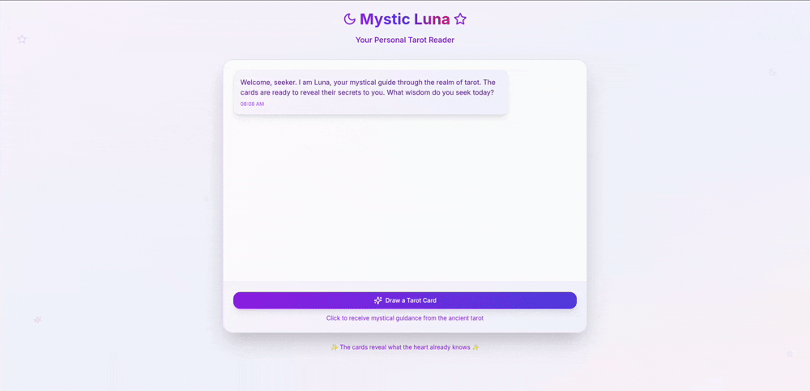

# Tarot Reading Project

## Idealization

I am a Frontend developer, with nearly 3 years of experience and working for the biggest beauty products company of Brazil. The theme about Tarot readings was choosen just to make it more fun as it is a subject I like very much.
My desire to do this project was to learn about Backend developemnt and in the near future be able to work as a full stack developer. Other than the usual Backend stuff I have decided to use the library Agno.
Agno is a python framework for building multi-agents. Since the arrival of ChatGPT I am a huge fan of its technology and since the AI agents surged it was a desire to learn how to use it. This is the first of many personal projects I want to do to practice and become fluent and work as Agentic developer.

---

## Images

---

## PS

As I have a solid experience as Frontend developer, I decided to use AI to generate the Frontend in order to make it faster and to focus on where I want to learn and practice. I believe praticing is the best way to learn so I decided to do this project using the same way the Backend is organized as the Backend in the project I work, to gain exprience enough to be able to get tasks in my team.

---

## Frontend

I generated the Frontend using https://bolt.new/ and NextJS. The whole app is in one file page.tsx. The only part of Frontend I coded was the Fetch function to the app be able to connect with the Backend. To the messages show on the running app I have used the structure that Bolt built.

---

## Backend

In my career I have done dozens of connections of the Frontend connection with Backend API so the Backend was done in the simplest way as possible as the main objective was to see a fullstack app running and functional and understand the flow of the data.

---

### Files

The files to run the backend are:

- agno_agent.py - contains the agent that does a request to the route that draw 3 random cards. Also from the 3 card do a reading using the gpt-3.5 LLM from OpenAI.
- main.py - initializes the app FastAPI and sets the cors so the backend can communicate with frontend without being blocked by the web navigator
- models.py - defines the models used by the route to connect with database
- routes.py - define 2 routes one with the 3 cards random that collects from the database and another route that calls the function from agno_agent to generate the reading
- schemas.py - define the schema which is used to validate data to the frontend
- utils.py - creates a connection with the database postgres

---

### Other Files

There are other files that were important to initiate the project:

- tarot.json - json with all information of the cards used to be put in the database
- populate_tarot.py - script to create the table a populate the database with the informations of the cards.

---

### Libs and stacks

You can find all needed libs in requirements.txt but these are the most relevant:

- agno - for the agent
- fastapi - routes
- pydantic - for the model
- requests - as the name says
- SQLAlchemy - deals with db
- uvicorn - run the app
- postgres - database
